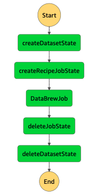

# Welcome to Dynamic Databrew Job Project

### SDK Direct Invocations
In this version of the state machine, we leverage SDK calls as Tasks within Step Functions. This allows a much cleaner deployment for our application, as we don't need to handle any Lambda functions, Lambda deployments, or Lambda permissions. Everything is completed within Step Functions (aside from actually running the DataBrew job). This drastically simplifies our application with one drawback: cost. Having two SDK calls in a row using step functions will cost more than having a single Lambda function execute both of those SDK calls. And that is because Step Function steps cost more than invoking a Lambda function to run those steps. Now if there was only one SDK call, it would be cheaper to use Step Functions directly, as you would then save the cost of the Lambda function. 

Overall, this solution is much cleaner and potentially worth the cost due to the simplicity of it.

The `cdk.json` file tells the CDK Toolkit how to execute your app.

## Useful commands

 * `npm run build`   compile typescript to js
 * `npm run watch`   watch for changes and compile
 * `npm run test`    perform the jest unit tests
 * `cdk deploy`      deploy this stack to your default AWS account/region
 * `cdk diff`        compare deployed stack with current state
 * `cdk synth`       emits the synthesized CloudFormation template
